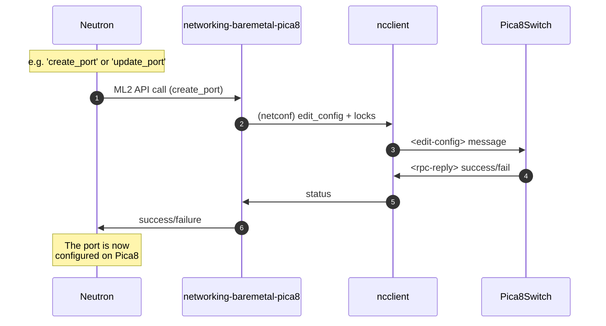

# networking-baremetal-pica8

This is a fork/extension of the [networking-baremetal](https://github.com/openstack/networking-baremetal) ML2 driver, **adapted** for **Pica8** switches that use an older or custom variant of OpenConfig.

It provides:
- A Neutron ML2 mechanism driver that interacts with Pica8 switches via Netconf/OpenConfig.
- L2 connectivity for baremetal or server ports, with optional LACP bonding (802.3ad).
- EVPN multi-homing (ESI-lag) support for dual-homed topologies, optionally auto-generating or collision-checking ES-IDs and MAC addresses.

## Key Features

1. **Netconf** integration:
   - Uses `ncclient` to send `<get>`, `<edit-config>` commands.
   - Locks the running (or candidate) datastore before modifying config.

2. **OpenConfig**-style resource management:
   - Creates/updates/deletes VLAN, aggregator interfaces, LACP parameters, EVPN bridging, etc.

3. **EVPN ESI-lag**:
   - Optionally, the driver can automatically generate or use user-supplied `(es_id, mac)` with collision detection, if multiple Pica8 switches share the same aggregator.

4. **Supports**:
   - VLAN access mode.
   - Non-bond or LACP-bond ports.
   - Pre-configured aggregates or driver-managed aggregates.

## Architecture Overview

Below is a **Mermaid** sequence diagram illustrating how Neutron (via ML2) calls the driver, which then uses Netconf to configure the Pica8 switch:



Neutron calls the driver's `create_port`, `update_port`, or `delete_port`.  
The driver builds OpenConfig objects (e.g. `Interfaces`, `LACP`, `VlanSwitchedVlan`) and calls netconf `<edit-config>`.  
The `ncclient` library sends it to the **Pica8** switch.

## Installation & Configuration

**Install** this driver into your Neutron environment:
```bash
git clone https://example.com/your-fork/networking-baremetal-pica8.git
cd networking-baremetal-pica8
pip install .
```

Edit your ml2_conf.ini (or wherever ML2 config is stored) to reference the baremetal-pica8 mechanism driver:

```ini
[ml2]
mechanism_drivers = openvswitch,baremetal-pica8
```

Configure the device group in neutron.conf or a dedicated config file:

```ini
[pica8-switch1]
host = 192.168.1.10
username = admin
password = adminPass
port_id_re_sub = {"pattern": "Ethernet", "repl": "eth"}
link_aggregate_prefix = Port-Channel
link_aggregate_range = 1000..2000
evpn = True
evpn_es_id =
evpn_es_sys_mac =
evpn_es_df_pref = 32767
manage_lacp_aggregates = True
```

Restart neutron-server to load the new driver.

## Usage

When you create ports in Neutron that map to a physical Pica8 switch, the driver:

- Sends `<edit-config>` to create VLAN membership or aggregator interfaces.
- Optionally sets EVPN parameters if `evpn=True`.
- If LACP aggregator is needed, merges or removes aggregator config depending on the bond mode.
- If you supply an operator ES-ID / MAC in the config, the driver checks if it's in use.
  - If so, logs "join aggregator."
  - If not, logs "create aggregator."

## Development / Testing

Unit tests: after installing dev dependencies, run:

```bash
"pytest --maxfail=1 --disable-warnings -v" or "python -m unittest discover ."
```
(or however your environment is set up).

Collision detection for ESI-lag is implemented in `_fetch_existing_esi_data(...)` / `get_unique_esi_lag(...)`.
Update `_fetch_existing_esi_data(...)` if your device's actual `<evpn>` structure is different.

## Contributing

PRs for improved Netconf transaction handling, additional VLAN modes, or custom device behaviors are welcome.
Code is under the Apache License Version 2.0.

## License

Apache License, Version 2.0
